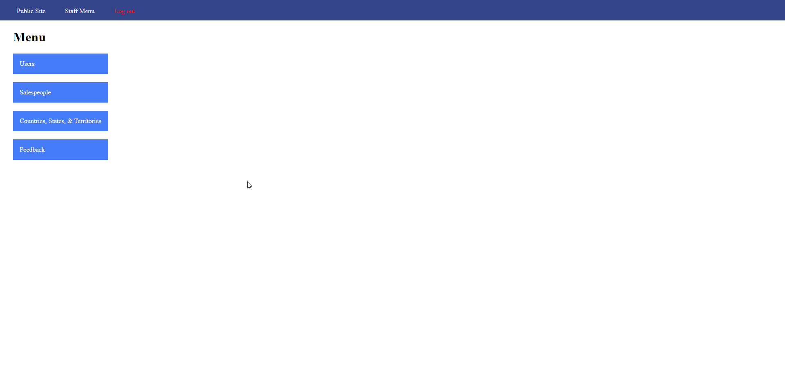
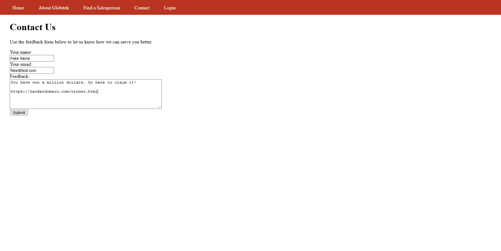
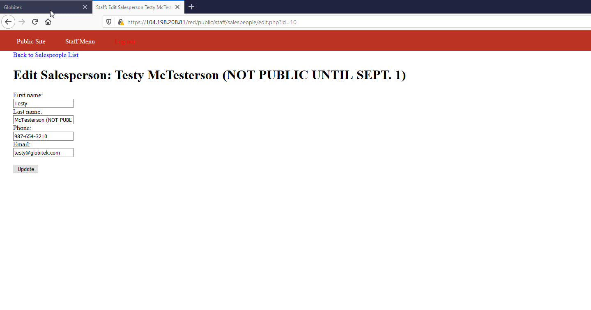
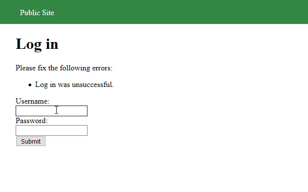
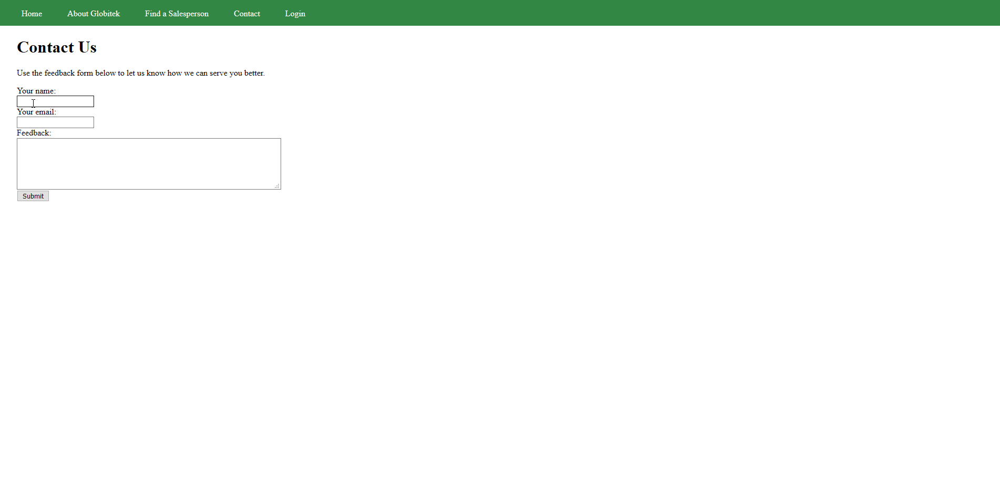

# Project 8 - Pentesting Live Targets

Time spent: **4** hours spent in total

> Objective: Identify vulnerabilities in three different versions of the Globitek website: blue, green, and red.

The six possible exploits are:

* Username Enumeration
* Insecure Direct Object Reference (IDOR)
* SQL Injection (SQLi)
* Cross-Site Scripting (XSS)
* Cross-Site Request Forgery (CSRF)
* Session Hijacking/Fixation

Each color is vulnerable to only 2 of the 6 possible exploits. First discover which color has the specific vulnerability, then write a short description of how to exploit it, and finally demonstrate it using screenshots compiled into a GIF.

## Blue

Vulnerability #1: SQL Injection

Description: In the request https://104.198.208.81/blue/public/salesperson.php?id=1 the ID parameter is vulnerable to a time-based blind SQL injection. I used SQLMap to identify this vulnerability. Here's what SQLMap found:
```
---
Parameter: id (GET)
    Type: boolean-based blind
    Title: AND boolean-based blind - WHERE or HAVING clause
    Payload: id=9' AND 5478=5478 AND 'ldnf'='ldnf

    Type: time-based blind
    Title: MySQL >= 5.0.12 AND time-based blind (query SLEEP)
    Payload: id=9' AND (SELECT 3260 FROM (SELECT(SLEEP(5)))Evaj) AND 'gOzU'='gOzU
---
```
Time based injection is slow, but it allows me access to the data in the database. For example, here are some of the users and their salted and hashed passwords:


Vulnerability #2: Session Hijacking/Fixation

Description: Basically if you are able to get the value of someone's session cookie you are able to take over their session in another browser.



## Red

Vulnerability #1: CSRF Form Vulnerability

Description: Basically you can put a form that will autosubmit into the contact page, and a link to it in the feedback form. It's a problem because on the red version of the site, the CSRF token is not validated, so it will accept the post request regardless of where it originated from.



Vulnerability #2: Insecure Direct Object Reference

Description: On the "Find a Salesperson" page, you are able to view a sales person by visiting https://104.198.208.81/red/public/salesperson.php?id=1 and replacing ID with the corresponding ID. The problem is that on the red site, it does not verify that you are permitted to veiw that sales person. For instance, in the sales person listing page in the admin site, it shows a couple of sales people that should not be visible (IDs 10 and 11). You are still able to view them on the public site by visiting https://104.198.208.81/red/public/salesperson.php?id=10 or https://104.198.208.81/red/public/salesperson.php?id=11.



## Green

Vulnerability #1: Username Enumeration

Description: For this vulnerability, on the log in screen, if the username exists and the login fails then it will be shown in bold, otherwise it will not be bolded.



Vulnerability #2: XSS Attack

Description: You can put arbitrary javascript in the feedback form, which will be rendered when the admin views the feedback.




## Notes

Describe any challenges encountered while doing the work
